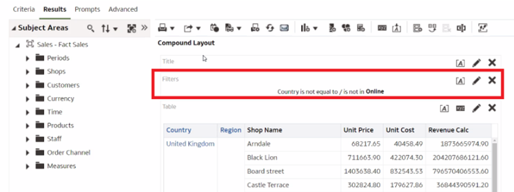
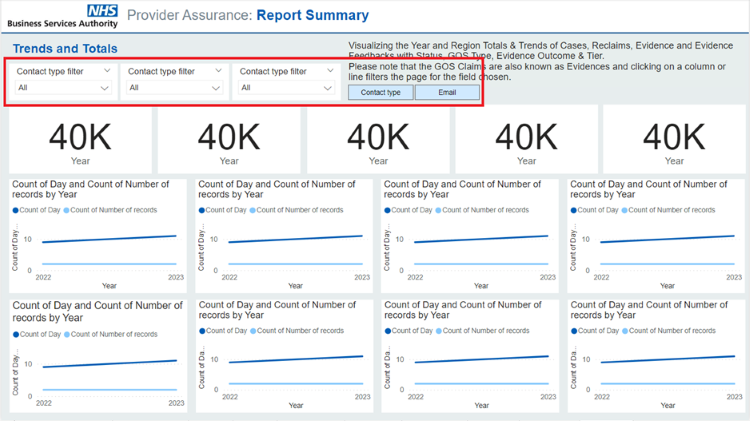

## Filter purpose  
  
Filters should only be used when needed and to add to the value of a dashboard. Due to this, the number of filters on a dashboard should be limited.  
If there are more than three filters on a dashboard this can take away the value and visual impact of the message and distract a user.  
  
Features such as parameters can be created and used to change variables used within a chart. An example is below:  
  

To ensure data literacy in our end users, and developers, any filters applied should always be clearly stated on the dashboard or report. For example, on Oracle Analytics Classic a disclaimer may be added onto the dashboard:  

  

## Placement of a filter  
  
Filters as best practice should be positioned as a banner across the top of the page starting from the left, as focus naturally falls to the left, or on the left-hand side. Having the filters on the left-hand side can take up unnecessary space. Considerations on the real estate of the page are important to consider in placing filters.  

::: details Source - dashboard design

[The Dos and Don'ts of Dashboard Design][filter 1]

:::

Icons can be used to hide filters if needed, if an icon is used the purpose of the icon should be stated for example, by accompanying text such as ‘Click the filter icon to filter the dashboard’. The icon should also have alternative text provided stating the purpose of the icon. If you have more than three filters on your page, using an icon can be a good way to hide the filters, and have the filters pop-out when the icon is clicked. This can offer usability and flexibility within your report.  

Global filters should be prioritised and included at the top left of a dashboard, or first in a filter section, with more specific filters following below. Specific filters relating to a singular chart should be placed close to the chart in the right-hand side top corner opposite the title of the chart, aligned with the visualisation itself.
An example of filters placed on the top left of a dashboard:  

  

Within some data visualisation tools filter panels can be included which may use less resource within your report. However, with a standard in-built filter you cannot customise the pane.  
  
Visualisations themselves can also be used as a filter. Many data visualisation tools have this inbuilt functionality.  

::: details Source - best practices

[Dashboard Design Best Practices][filter 2]
:::

## Design of a filter  

A filter should be used to enable functionality of a dashboard for a user, but not distract from the main content.

- The filter should clearly state its purpose. A label as a header, such as ‘Contact type filter’ is useful.
- A user should always be able to clearly tell which filters are in place. To do this, use dynamic titles on your charts.
- A ‘clear selection’ button in the top right-hand side of the screen is optional. This is to allow the user to quickly remove any filters applied and ensure that the report can be quickly set to be unfiltered should a user need this:  

  
  
- A font size of 11px should be used to Header the filter.
- Frutiger or Arial should be used as the font, consistent with the rest of your report.
- Filters should be of equal widths and heights if possible.
- No borders or shadow borders should be used on a filter so as not to distract the user with additional ink to look at.
- Filters should have a white background.
- If the filter includes a timeline, NHS Blue (#005EB8) should be used:  

[filter 1]: https://towardsdatascience.com/the-dos-and-donts-of-dashboard-design-2beefd5cc575
[filter 2]: https://chartio.com/blog/dashboard-design-best-practices-the-dashboard-layout/